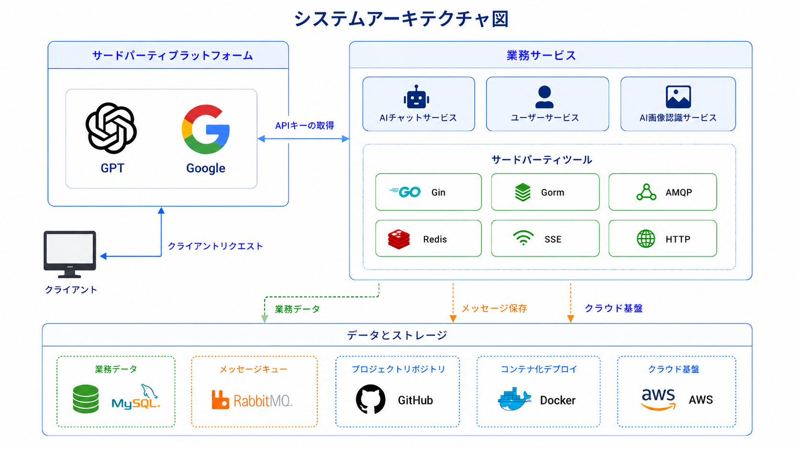
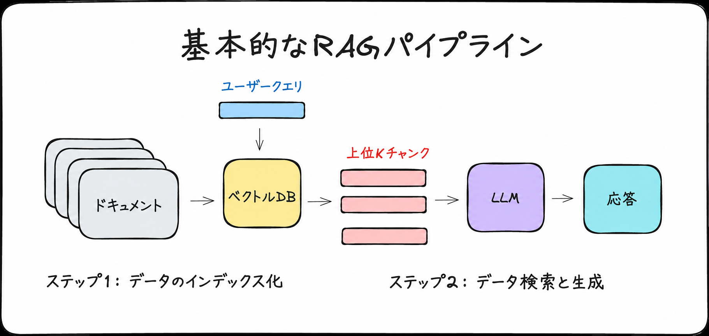

# GoNexus : AI Chat Platform

GoNexus 是一个 AI 聊天平台，核心目标是把用户登录、会话管理、流式 AI 聊天、RAG 本地知识库、图片识别和云端部署串成一套完整应用。

<p align="left">
  <strong>中文</strong> |
  <a href="./docs/ja/README.md">日本語</a> |
  <a href="./docs/en/README.md">English</a>
</p>

---

## 项目展示


---

## 技术栈

- 前端：React、TypeScript、Vite、Tailwind CSS、Zustand、Axios。
- 后端：Go、Gin、JWT、Eino、OpenAI 兼容模型接口。
- 存储与中间件：MySQL、Redis Stack、RabbitMQ。
- 部署：Docker Compose、本地容器化、GitHub Actions、AWS ECR、ECS、S3。

---

## 架构图



---

## 核心功能

- **实时聊天**：使用 Server-Sent Events（SSE）实现 AI 回答的流式输出。
- **RAG 支持**：支持上传文档，结合本地知识内容增强 AI 回答。
- **会话管理**：聊天历史持久化存储在 MySQL 中，并支持跨会话同步。
- **多模型支持**：通过后端统一接口，可以方便地切换不同的 AI 模型服务提供商。



---

## 内容导航

| 章节 | 关键内容 | 状态 |
| ---- | -------- | ---- |
| [01. 用户认证](./docs/zh/01.%E7%94%A8%E6%88%B7%E8%AE%A4%E8%AF%81.md) | 登录请求、账号密码校验、JWT 生成与返回 | ✅ |
| [02. 聊天链路](./docs/zh/02.%E8%81%8A%E5%A4%A9%E9%93%BE%E8%B7%AF.md) | SSE 流式聊天、AIHelper、模型调用、前端更新 | ✅ |
| [03. 会话与消息持久化](./docs/zh/03.%E4%BC%9A%E8%AF%9D%E4%B8%8E%E6%B6%88%E6%81%AF%E6%8C%81%E4%B9%85%E5%8C%96.md) | 内存上下文、RabbitMQ 异步保存、DAO 写入 MySQL | ✅ |
| [04. RAG 知识库链路](./docs/zh/04.RAG%E7%9F%A5%E8%AF%86%E5%BA%93%E9%93%BE%E8%B7%AF.md) | 文档上传、chunk 切分、embedding、Redis 向量检索 | ✅ |
| [05. 图片识别链路](./docs/zh/05.%E5%9B%BE%E7%89%87%E8%AF%86%E5%88%AB%E9%93%BE%E8%B7%AF.md) | 图片上传、base64 转换、Vision API 调用与结果返回 | ✅ |
| [06. Docker 部署链路](./docs/zh/06.Docker%E9%83%A8%E7%BD%B2%E9%93%BE%E8%B7%AF.md) | Compose 启动、镜像构建、容器通信、Nginx 代理 | ✅ |

---

## 快速开始

### 1. 启动基础设施

请确保已经安装并启动 Docker，然后运行以下命令启动项目所需服务：

```bash
cd GoNexus
docker-compose up -d
```

### 2. 配置并启动后端

1. 将 `GoNexus/config/config.example.toml` 复制为 `GoNexus/config/config.toml`，并填写本地环境所需配置。请勿将 `config.toml` 提交到 Git 仓库。
2. 安装依赖并启动后端：

```bash
go mod tidy
go run main.go
```

云端部署时，可以通过环境变量注入配置，例如：

`GONEXUS_MYSQL_HOST`、`GONEXUS_REDIS_HOST`、`GONEXUS_RABBITMQ_HOST`、`GONEXUS_JWT_KEY`、`LLM_API_KEY`、`LLM_MODEL_ID` 和 `LLM_BASE_URL`。

### 3. 配置并启动前端

1. 进入 `GoNexus/frontend` 目录。
2. 安装依赖并启动开发服务器：

```bash
npm install
npm run dev
```

---

## 参与贡献

欢迎提交 Issue 或 Pull Request。

---

## 开源协议

本项目基于 GNU General Public License v3.0 开源协议发布。
