<div align="center">
  <h1>GoNexus</h1>
  <p><b>Chat, search, analyze, recognize, and reason with multimodal AI over your private knowledge base.</b></p>
</div>

<table align="center">
  <tr>
    <td align="center"><strong>中文</strong> · <a href="../ja/README_ja.md">日本語</a> · <a href="../en/README_en.md">English</a></td>
  </tr>
</table>


<p align="center">
  <a href="../../LICENSE">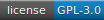</a>
  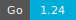
  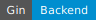
  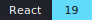
  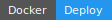
  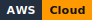
</p>

> 💡 GoNexus 是一个支持私有知识库增强问答的 AI 聊天平台。它可以在用户对话时检索本地上传的内部资料，并结合大模型生成更贴合业务语境的回答，同时整合了用户登录、会话管理、流式聊天、图片识别和云端部署等完整应用能力。
<div align="center">
  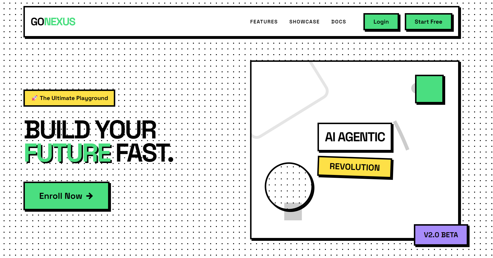
</div>


---

## 技术栈

- 前端：React、TypeScript、Vite、Tailwind CSS、Zustand、Axios。
- 后端：Go、Gin、JWT、Eino、OpenAI 兼容模型接口。
- 存储与中间件：MySQL、Redis Stack、RabbitMQ。
- 部署：Docker、GitHub Actions、AWS。
---

## 架构图
<div align="center">
  
</div>


---

## 核心功能

- **实时聊天**：使用 Server-Sent Events（SSE）实现 AI 回答的流式输出。
- **RAG 支持**：支持上传文档，结合本地知识内容增强 AI 回答。
- **会话管理**：聊天历史持久化存储在 MySQL 中，并支持跨会话同步。
- **多模型支持**：可切换不同的 AI 模型服务提供商，支持本地模型 Ollama。
<div align="center">
  
</div>

---

## AWS 架构

<div align="center">
  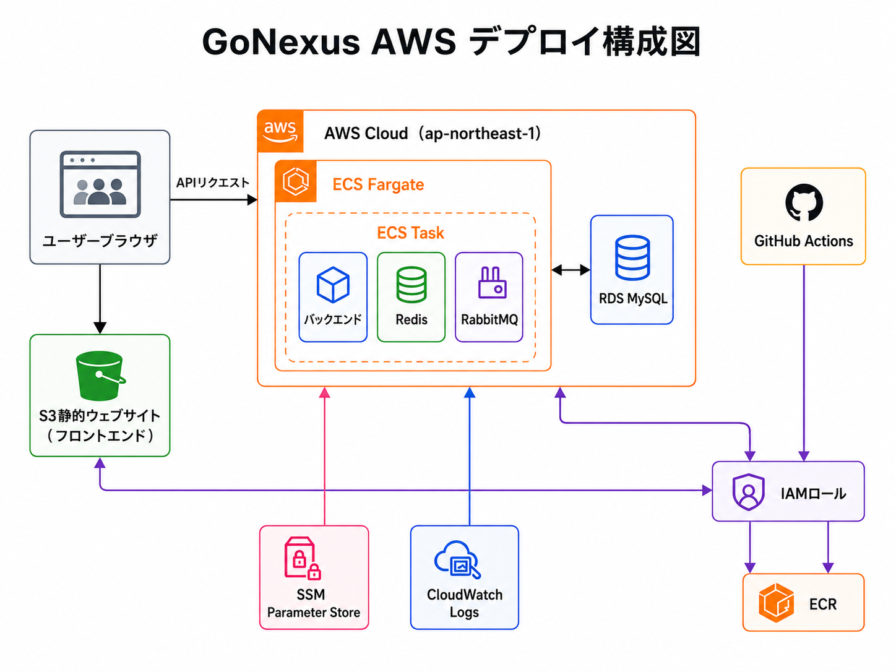
</div>


---

## **功能展示**

### 1. 登录与注册

<div align="center">
  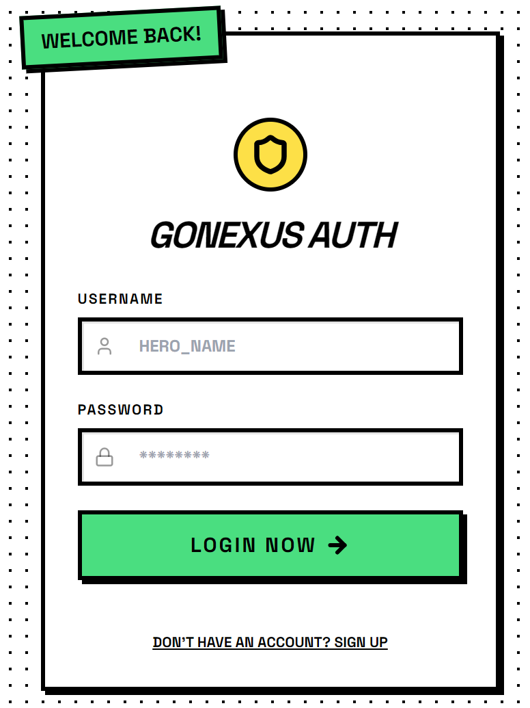
  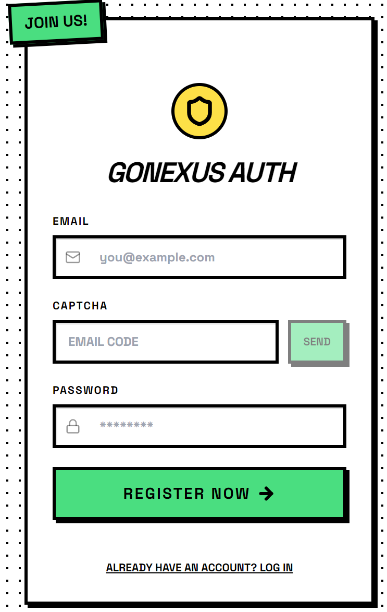
</div>
### 2. AI 对话

<div align="center">
  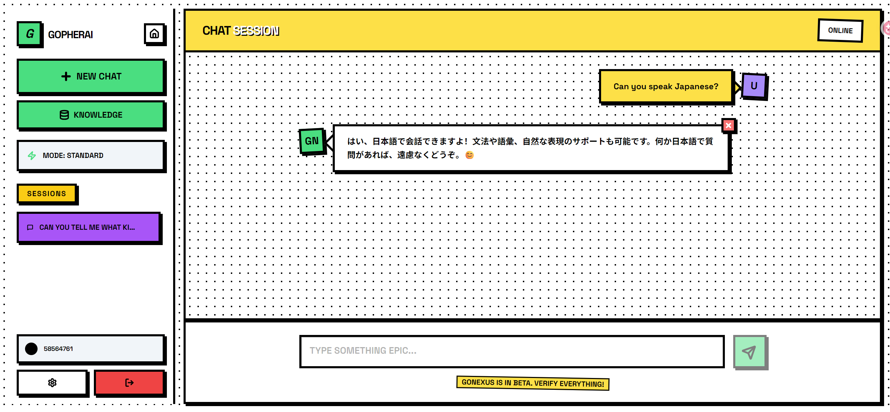
</div>
### 3. 私有知识库上传

<div align="center">
  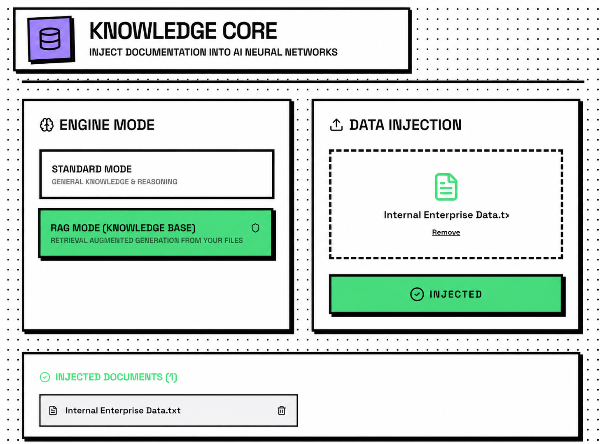
</div>
### 4. 图像分析

<div align="center">
  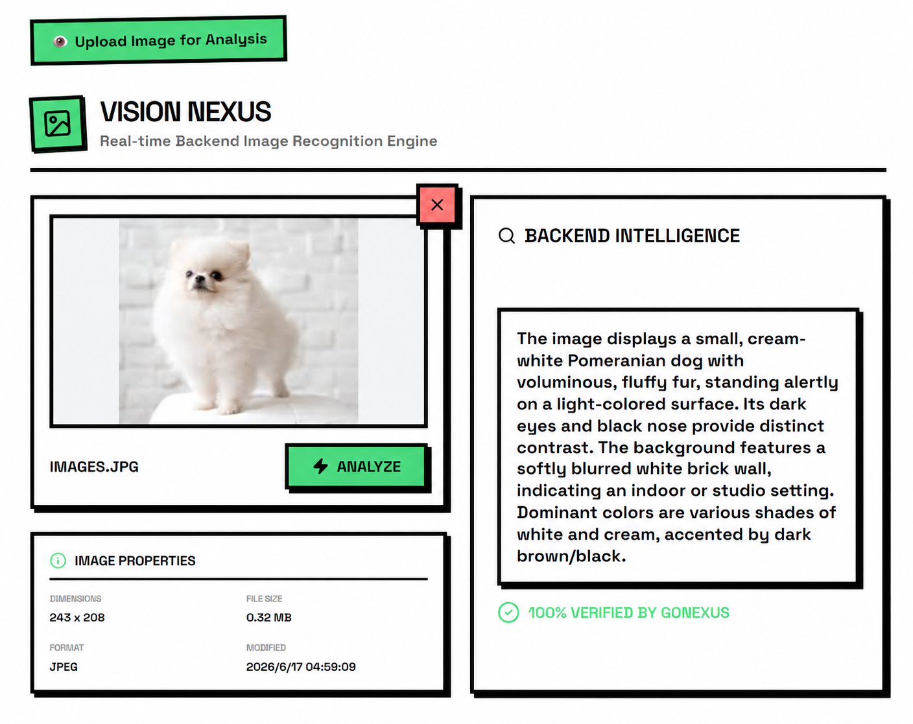
</div>

---

## 原理说明

| 章节 | 关键内容 | 状态 |
| ---- | -------- | ---- |
| [01. 用户认证](./01.用户认证.md) | 登录请求、账号密码校验、JWT 生成与返回 | ✅ |
| [02. 聊天链路](./02.聊天链路.md) | SSE 流式聊天、AIHelper、模型调用、前端更新 | ✅ |
| [03. 会话与消息持久化](./03.会话与消息持久化.md) | 内存上下文、RabbitMQ 异步保存、DAO 写入 MySQL | ✅ |
| [04. RAG 知识库链路](./04.RAG知识库链路.md) | 文档上传、chunk 切分、embedding、Redis 向量检索 | ✅ |
| [05. 图片识别链路](./05.图片识别链路.md) | 图片上传、base64 转换、Vision API 调用与结果返回 | ✅ |
| [06. Docker 部署链路](./06.Docker部署链路.md) | Compose 启动、镜像构建、容器通信、Nginx 代理 | ✅ |

---

## 本地使用

### 1. 启动基础设施

请确保已经安装并启动 Docker，然后运行以下命令启动项目所需服务：

```bash
cd GoNexus
docker-compose up -d
```

### 2. 配置并启动后端

1. 将 `GoNexus/config/config.example.toml` 复制为 `GoNexus/config/config.toml`，并填写本地环境所需配置。请勿将 `config.toml` 提交到 Git 仓库。
2. 安装依赖并启动后端：

```bash
go mod tidy
go run main.go
```

云端部署时，可以通过环境变量注入配置，例如：

`GONEXUS_MYSQL_HOST`、`GONEXUS_REDIS_HOST`、`GONEXUS_RABBITMQ_HOST`、`GONEXUS_JWT_KEY`、`LLM_API_KEY`、`LLM_MODEL_ID` 和 `LLM_BASE_URL`。

### 3. 配置并启动前端

1. 进入 `GoNexus/frontend` 目录。
2. 安装依赖并启动开发服务器：

```bash
npm install
npm run dev
```

---

## 参与贡献

欢迎提交 Issue 或 Pull Request。

---

## 开源协议

本项目基于 [GNU General Public License v3.0](../../LICENSE) 开源协议发布。


