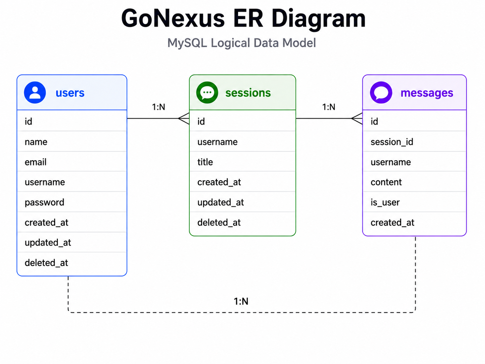

<div align="center">
  <h1>GoNexus</h1>
  <p><b>Chat, search, analyze, recognize, and reason with multimodal AI over your private knowledge base.</b></p>
</div>

<table align="center">
  <tr>
    <td align="center"><a href="../cn/README_cn.md">中文</a> · <strong>日本語</strong> · <a href="../en/README_en.md">English</a></td>
  </tr>
</table>

<p align="center">
  <a href="../../LICENSE"></a>
  
  
  
  
  
</p>

> 💡 GoNexus は、プライベートナレッジベースを活用した Q&A に対応するフルスタック AI チャットプラットフォームです。ユーザーとの対話中にローカルへアップロードされた内部資料を検索し、大規模言語モデルと組み合わせることで、業務文脈により合った回答を生成します。さらに、ユーザー認証、セッション管理、ストリーミングチャット、画像認識、クラウドデプロイまでを一つのアプリケーションとして統合しています。

<div align="center">
  
</div>

---

## 技術スタック

- フロントエンド：React、TypeScript、Vite、Tailwind CSS、Zustand、Axios。
- バックエンド：Go、Gin、JWT、Eino、OpenAI 互換モデル API。
- ストレージとミドルウェア：MySQL、Redis Stack、RabbitMQ。
- デプロイ：Docker、GitHub Actions、AWS。

---

## 機能紹介

### 1. ログインと登録

<div align="center">
  
  
</div>

### 2. AI チャット

<div align="center">
  
</div>

### 3. プライベートナレッジベースのアップロード

<div align="center">
  
</div>

### 4. 画像分析

<div align="center">
  
</div>

---

## アーキテクチャ

<div align="center">
  
</div>

---

## 主な機能

- **リアルタイムチャット**：Server-Sent Events（SSE）で AI の回答をストリーミング出力します。
- **RAG 対応**：文書をアップロードし、ローカル知識を使って AI の回答を強化します。
- **セッション管理**：チャット履歴を MySQL に永続化し、複数セッションの同期に対応します。
- **マルチモデル対応**：複数の AI モデルプロバイダーを切り替えられ、ローカルモデル Ollama にも対応します。

<div align="center">
  
</div>

---

## AWS アーキテクチャ

<div align="center">
  
</div>

---

## ER 図

<div align="center">
  
</div>

---

## 仕組みの説明

| セクション | 主な内容 | 状態 |
| ---- | -------- | ---- |
| [01. ユーザー認証](./01.%E3%83%A6%E3%83%BC%E3%82%B6%E3%83%BC%E8%AA%8D%E8%A8%BC.md) | ログインリクエスト、認証情報の検証、JWT の生成と返却 | ✅ |
| [02. チャット連携](./02.%E3%83%81%E3%83%A3%E3%83%83%E3%83%88%E9%80%A3%E6%90%BA.md) | SSE ストリーミングチャット、AIHelper、モデル呼び出し、フロントエンド更新 | ✅ |
| [03. 会話とメッセージ永続化](./03.%E4%BC%9A%E8%A9%B1%E3%81%A8%E3%83%A1%E3%83%83%E3%82%BB%E3%83%BC%E3%82%B8%E6%B0%B8%E7%B6%9A%E5%8C%96.md) | メモリコンテキスト、RabbitMQ 非同期保存、DAO による MySQL 書き込み | ✅ |
| [04. RAG ナレッジベース連携](./04.RAG%E3%83%8A%E3%83%AC%E3%83%83%E3%82%B8%E3%83%99%E3%83%BC%E3%82%B9%E9%80%A3%E6%90%BA.md) | 文書アップロード、chunk 分割、embedding、Redis ベクトル検索 | ✅ |
| [05. 画像認識連携](./05.%E7%94%BB%E5%83%8F%E8%AA%8D%E8%AD%98%E9%80%A3%E6%90%BA.md) | 画像アップロード、base64 変換、Vision API 呼び出しと結果返却 | ✅ |
| [06. Docker デプロイ連携](./06.Docker%E3%83%87%E3%83%97%E3%83%AD%E3%82%A4%E9%80%A3%E6%90%BA.md) | Compose 起動、イメージビルド、コンテナ通信、Nginx プロキシ | ✅ |

---

## ローカルでの利用

### 1. 基盤サービスを起動

Docker がインストールされ、起動していることを確認してから、必要なサービスを起動します。

```bash
cd GoNexus
docker-compose up -d
```

### 2. バックエンドを設定して起動

1. `GoNexus/config/config.example.toml` を `GoNexus/config/config.toml` にコピーし、ローカル環境に必要な設定を入力します。`config.toml` は Git にコミットしないでください。
2. 依存関係をインストールし、バックエンドを起動します。

```bash
go mod tidy
go run main.go
```

クラウドデプロイ時は、次のような環境変数で設定を注入できます。

`GONEXUS_MYSQL_HOST`、`GONEXUS_REDIS_HOST`、`GONEXUS_RABBITMQ_HOST`、`GONEXUS_JWT_KEY`、`LLM_API_KEY`、`LLM_MODEL_ID`、`LLM_BASE_URL`

### 3. フロントエンドを設定して起動

1. `GoNexus/frontend` ディレクトリに移動します。
2. 依存関係をインストールし、開発サーバーを起動します。

```bash
npm install
npm run dev
```

---

## コントリビューション

Issue や Pull Request を歓迎します。

---

## ライセンス

このプロジェクトは [GNU General Public License v3.0](../../LICENSE) の下で公開されています。
